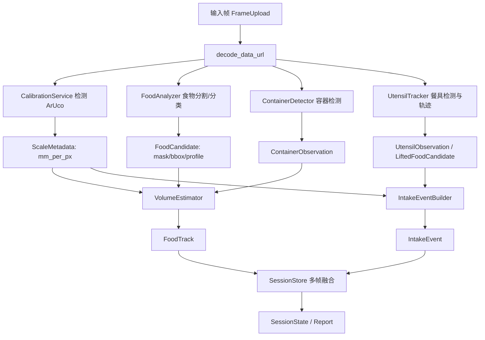
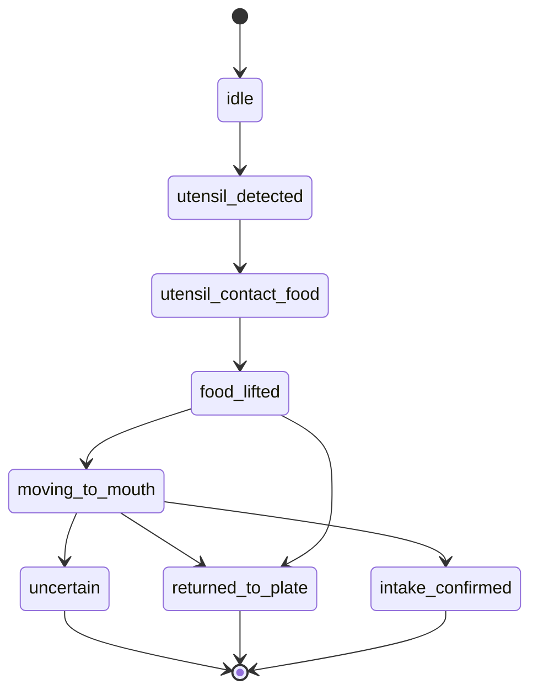

# 克重标定、容器模型与餐具摄入事件技术设计文档

> 关联需求文档：`recognition_algorithm/docs/weight_calibration_requirements.md`
>
> 适用代码目录：`recognition_algorithm/code/demo`
>
> 文档目标：将“标定卡 + 精细化克重估算 + 容器模型 + 餐具摄入事件”的产品需求转化为可开发、可测试、可迭代的技术方案。

## 1. 技术目标

本次改造的目标不是简单提高现有面积估重公式的稳定性，而是重构食物摄入数据采集链路。

核心技术目标：

1. 使用 `50mm x 50mm` 实体 `ArUco marker` 获取真实世界尺度。
2. 将食物 mask 像素面积转换为真实物理面积。
3. 使用食物类别、形态和容器模型估算体积与克重。
4. 通过餐具检测和轨迹跟踪识别实际摄入事件。
5. 将最终摄入记录从“碗盘剩余量变化”升级为“confirmed IntakeEvent 累计 + 容器剩余量校验”。
6. 保持无标定卡场景可用，但明确降级为粗估。

第一版不追求电子秤精度，定位为营养估算级识别。

## 2. 现有实现分析

### 2.1 当前单帧估重逻辑

现有单帧估重位于：

```text
backend/services/analyzer.py
FoodAnalyzer._track_from_region()
```

当前核心公式：

```python
area_ratio = true_area_px / frame_area
plate_scale_ml = 980
compactness = sqrt(area_ratio) * 2.05
volume_ml = area_ratio * plate_scale_ml * compactness
estimated_weight = volume_ml * density_g_per_ml
```

问题：

1. `area_ratio` 是图像占比，不是真实物理面积。
2. `plate_scale_ml` 是全局经验值，无法适配不同距离、焦距、容器和拍摄角度。
3. 多帧平滑只能降低抖动，不能纠正尺度错误。

### 2.2 当前多帧融合逻辑

现有多帧融合位于：

```text
backend/services/session_store.py
TrackAggregate
SessionStore._scale_adjusted_measurement()
```

当前逻辑会保存：

```python
accepted_weight_samples
accepted_area_ratios
reference_weight_g
reference_area_ratio
```

问题：

1. `reference_weight_g` 仍来自单帧经验估重。
2. 一旦早期稳定帧估错，后续帧会把错误固定下来。
3. 不能区分“真实尺度标定帧”和“视觉粗估帧”。
4. 没有餐具摄入事件，无法记录用户真正吃掉的食物。

### 2.3 当前数据模型

现有模型位于：

```text
backend/models/schemas.py
```

现有 `FoodTrack` 可以表达食物识别、bbox、polygon、估重、营养，但缺少：

1. 标定卡元数据。
2. 真实面积与高度模型字段。
3. 容器字段。
4. 餐具事件字段。
5. 单次摄入事件模型。

## 3. 总体架构

### 3.1 改造后处理链路



### 3.2 新增服务模块

建议新增以下模块：

```text
backend/services/calibration.py
backend/services/volume_estimator.py
backend/services/container_detector.py
backend/services/utensil_tracker.py
backend/services/consumption_tracker.py
```

模块职责：

| 模块 | 职责 | 输入 | 输出 |
|---|---|---|---|
| `calibration.py` | 检测 ArUco marker，计算真实尺度 | RGB frame | `ScaleMetadata` |
| `volume_estimator.py` | 将面积、类别、容器转换为体积和重量 | food candidate + scale + container | `WeightEstimate` |
| `container_detector.py` | 检测盘、碗、餐盒，提供容器约束 | RGB frame + food masks | `ContainerObservation` |
| `utensil_tracker.py` | 检测筷子、勺子、叉子及餐具携带食物 | frame sequence | `UtensilObservation` / `LiftedFoodCandidate` |
| `consumption_tracker.py` | 维护 `IntakeEvent`，累计摄入，判断完成状态 | FoodTrack + observations + events | consumption state |

## 4. 标定卡检测设计

### 4.1 配置

固定配置：

```python
ARUCO_DICT = cv2.aruco.DICT_5X5_100
VALID_MARKER_IDS = {23, 42}
MARKER_SIZE_MM = 50.0
MIN_SCALE_CONFIDENCE = 0.55
```

依赖：

```text
opencv-contrib-python-headless
```

### 4.2 数据结构

```python
from dataclasses import dataclass

@dataclass
class ScaleMetadata:
    detected: bool
    marker_id: int | None
    marker_size_mm: float
    corners_px: list[list[float]]
    edge_lengths_px: list[float]
    mm_per_px: float
    px_per_mm: float
    marker_area_px: float
    marker_area_ratio: float
    perspective_score: float
    sharpness_score: float
    confidence: float
    status: str
```

`status` 可选：

```text
detected
not_found
invalid_id
too_small
too_blurry
too_skewed
occluded
```

### 4.3 检测流程

```python
def detect_scale_marker(rgb: np.ndarray) -> ScaleMetadata:
    gray = cv2.cvtColor(rgb, cv2.COLOR_RGB2GRAY)
    dictionary = cv2.aruco.getPredefinedDictionary(cv2.aruco.DICT_5X5_100)
    detector = cv2.aruco.ArucoDetector(dictionary, cv2.aruco.DetectorParameters())
    corners, ids, rejected = detector.detectMarkers(gray)
    candidate = select_best_marker(corners, ids)
    return compute_scale_metadata(candidate, gray.shape)
```

### 4.4 尺度计算

marker 四边像素长度：

```text
top = distance(c0, c1)
right = distance(c1, c2)
bottom = distance(c2, c3)
left = distance(c3, c0)
edge_px = mean(top, right, bottom, left)
mm_per_px = 50.0 / edge_px
```

透视评分：

```text
edge_ratio = min(edge_lengths) / max(edge_lengths)
perspective_score = clamp((edge_ratio - 0.55) / (0.90 - 0.55), 0, 1)
```

面积评分：

```text
marker_area_ratio = marker_area_px / frame_area
area_score = clamp(marker_area_ratio / 0.015, 0, 1)
```

最终置信度：

```text
scale_confidence =
  area_score * 0.30
+ perspective_score * 0.30
+ sharpness_score * 0.25
+ id_score * 0.15
```

有效估重阈值：

```text
scale_confidence >= 0.55
```

## 5. 克重估算设计

### 5.1 新旧公式切换

旧公式保留为 fallback：

```text
weight_source = visual_fallback
```

有标定卡时使用真实尺度公式：

```text
weight_source = aruco_calibrated
```

容器模型参与时：

```text
weight_source = container_model
```

### 5.2 数据结构

```python
@dataclass
class FoodVolumeProfile:
    profile_key: str
    volume_model: str
    default_height_cm: float
    min_height_cm: float
    max_height_cm: float
    shape_factor: float
    volume_confidence: float

@dataclass
class WeightEstimate:
    weight_g: float
    weight_error_g: float
    volume_ml: float
    area_cm2: float
    estimated_height_cm: float
    shape_factor: float
    density_g_per_ml: float
    weight_source: str
    estimation_level: str
    confidence: float
```

### 5.3 有标定卡食物估重

```python
def estimate_calibrated_food_weight(
    mask_area_px: int,
    profile: FoodProfile,
    volume_profile: FoodVolumeProfile,
    scale: ScaleMetadata,
    container: ContainerObservation | None,
) -> WeightEstimate:
    area_mm2 = mask_area_px * scale.mm_per_px * scale.mm_per_px
    area_cm2 = area_mm2 / 100.0
    height_cm = estimate_height(profile, volume_profile, container)
    volume_ml = area_cm2 * height_cm * volume_profile.shape_factor
    weight_g = volume_ml * profile.density_g_per_ml
    return WeightEstimate(...)
```

### 5.4 食物体积模型

第一版体积模型：

| `volume_model` | 适用对象 | 估算方式 |
|---|---|---|
| `flat_solid` | 饼干、薄片、煎蛋 | `area_cm2 * fixed_height` |
| `block_solid` | 蛋糕、面包、鸡排、馒头 | `area_cm2 * class_height * shape_factor` |
| `mound` | 米饭、炒饭、面条 | `area_cm2 * mound_height * shape_factor` |
| `loose_leafy` | 青菜、沙拉 | 低密度蓬松模型 |
| `container_fill` | 碗饭、粥、汤、餐盒饭 | 容器面积和填充比例 |
| `unknown` | 未知食物 | fallback 粗估 |

示例初始参数：

```python
FOOD_VOLUME_PROFILES = {
    "rice": FoodVolumeProfile("rice", "mound", 2.6, 1.5, 4.2, 0.65, 0.62),
    "chicken": FoodVolumeProfile("chicken", "block_solid", 1.8, 1.0, 3.0, 0.75, 0.70),
    "cake": FoodVolumeProfile("cake", "block_solid", 3.2, 2.0, 5.0, 0.80, 0.72),
    "bok_choy": FoodVolumeProfile("bok_choy", "loose_leafy", 3.0, 1.5, 5.0, 0.35, 0.42),
}
```

### 5.5 误差估计

误差应综合以下因素：

```text
scale_error
mask_error
height_error
density_error
container_error
classification_error
```

建议第一版：

```text
relative_error =
  0.10
+ (1 - scale_confidence) * 0.20
+ (1 - mask_confidence) * 0.20
+ height_uncertainty_ratio * 0.30
+ density_std / density * 0.20
+ container_penalty
```

输出：

```text
weight_error_g = max(3.5, weight_g * relative_error)
```

## 6. 容器检测设计

### 6.1 容器观测结构

```python
@dataclass
class ContainerObservation:
    container_id: str
    type: str  # plate / bowl / tray / box / none / unknown
    bbox: list[int]
    polygon: list[list[int]]
    ellipse: tuple[float, float, float, float, float] | None
    confidence: float
    area_px: float
    area_cm2: float | None
    fill_ratio: float | None
    depth_model: str
```

### 6.2 第一版检测策略

第一版不要求训练专用容器模型，可先使用 OpenCV 几何规则：

1. 圆盘/碗：边缘检测 + 椭圆拟合。
2. 矩形餐盒：Canny + HoughLinesP + 四边形轮廓。
3. 容器与食物关系：食物 mask 中心是否落在容器内。

后续如有数据集，再替换为 YOLO/Segmentation 容器模型。

### 6.3 容器参与估重

容器用于：

1. 限定食物所在区域。
2. 判断剩余量变化。
3. 为碗装/盒装食物提供填充模型。
4. 辅助判断餐具从哪个食物/容器取食。

容器不能单独替代标定卡。无标定卡时，容器只能辅助粗估。

## 7. 餐具与摄入事件设计

### 7.1 目标

系统最终要记录用户实际吃掉了什么，而不仅是盘子里少了什么。

餐具摄入事件是核心证据：

```text
餐具接触食物 -> 食物随餐具离开容器 -> 向口部/用户方向移动 -> 食物从餐具区域消失或离开画面 -> 摄入确认
```

### 7.2 餐具检测对象

第一版支持：

```text
chopsticks
spoon
fork
unknown_utensil
```

实现策略分两档：

1. MVP：使用几何和颜色规则检测餐具候选。
2. 进阶：训练 YOLO 检测 `chopsticks/spoon/fork/hand/mouth`。

### 7.3 餐具观测结构

```python
@dataclass
class UtensilObservation:
    utensil_id: str
    utensil_type: str
    bbox: list[int]
    keypoints: dict[str, list[float]]
    tip_point: list[float] | None
    bowl_point: list[float] | None
    confidence: float
    motion_vector: list[float]
    contact_food_track_id: str | None
    carried_food_area_px: int
    carried_food_mask: list[list[int]]
```

餐具关键点建议：

| 餐具 | 关键点 |
|---|---|
| 筷子 | 两根筷子的夹取端、手持端、方向向量 |
| 勺子 | 勺面中心、勺柄方向、勺面轮廓 |
| 叉子 | 叉尖区域、柄方向 |

### 7.4 LiftedFoodCandidate

餐具附近的小块食物需要独立建模：

```python
@dataclass
class LiftedFoodCandidate:
    bbox: list[int]
    mask_area_px: int
    polygon: list[list[int]]
    source_track_id: str | None
    source_confidence: float
    profile_key: str
    food_confidence: float
    attached_utensil_id: str
    area_cm2: float | None
    estimated_bite_weight_g: float
    confidence: float
```

### 7.5 IntakeEvent 状态机



确认摄入条件：

```text
1. 餐具曾接触食物区域。
2. 餐具附近出现 carried food mask。
3. carried food 离开原容器区域。
4. carried food 沿合理方向移动。
5. carried food 未回到容器，且在餐具靠近口部/画面边缘/用户方向后消失。
```

放回盘中条件：

```text
1. carried food 随餐具移动后再次与来源容器/食物区域重叠。
2. 来源容器剩余重量没有下降或下降量很小。
3. 餐具离开后 carried food mask 仍留在容器区域。
```

### 7.6 单口克重估算

有标定卡时：

```python
area_cm2 = carried_food_area_px * scale.mm_per_px**2 / 100
height_cm = estimate_bite_height(profile_key, utensil_type)
volume_ml = area_cm2 * height_cm * bite_shape_factor
bite_weight_g = volume_ml * density_g_per_ml
```

按餐具修正：

| 餐具 | 修正策略 |
|---|---|
| 筷子 | 小块固体，厚度取来源食物模型的 60%-90% |
| 勺子 | 若能检测勺面，使用勺面填充比例和食物高度 |
| 叉子 | 以叉尖附近 mask 为主，厚度接近实体食物 |

无标定卡时：

```text
weight_source = visual_fallback
intake_confidence <= 0.45
```

### 7.7 食物来源归属

来源归属评分：

```text
source_score =
  contact_overlap_score * 0.35
+ spatial_distance_score * 0.20
+ color_texture_score * 0.20
+ profile_similarity_score * 0.15
+ temporal_consistency_score * 0.10
```

混合菜/多来源场景：

```python
mixed_sources = [
    {"track_id": "food_1", "ratio": 0.65, "confidence": 0.70},
    {"track_id": "food_2", "ratio": 0.35, "confidence": 0.54},
]
```

## 8. 多帧融合与会话状态

### 8.1 现有 TrackAggregate 改造

当前 `TrackAggregate` 存储历史重量样本和 reference weight。改造后建议：

```python
@dataclass
class TrackAggregate:
    track_id: str
    track: FoodTrack
    first_seen_seconds: float
    last_seen_seconds: float
    visible_frames: int = 1
    missed_frames: int = 0
    observations: list[WeightObservation] = field(default_factory=list)
    calibrated_observations: list[WeightObservation] = field(default_factory=list)
    rough_observations: list[WeightObservation] = field(default_factory=list)
    intake_events: list[IntakeEvent] = field(default_factory=list)
    initial_weight_g: float | None = None
    current_weight_g: float | None = None
    intake_weight_sum_g: float = 0
    remaining_ratio: float | None = None
    consumption_state: str = "observing"
```

### 8.2 WeightObservation

```python
@dataclass
class WeightObservation:
    timestamp_ms: int
    frame_index: int
    track_id: str
    weight_g: float
    raw_weight_g: float
    volume_ml: float
    area_cm2: float
    scale_mm_per_px: float
    scale_confidence: float
    mask_confidence: float
    weight_source: str
    estimation_level: str
    container_type: str
    occlusion_score: float
    is_valid_for_fusion: bool
```

### 8.3 融合规则

有效 calibrated observation：

```text
scale_confidence >= 0.55
mask_confidence >= 0.45
occlusion_score <= 0.35
weight_source in {"aruco_calibrated", "container_model"}
```

融合方式：

```text
weight = weighted_median(valid_observations)
weight = trimmed_mean(valid_observations)  # fallback
```

权重：

```text
weight_i =
  scale_confidence
* mask_confidence
* food_confidence
* (1 - occlusion_score)
```

### 8.4 摄入累计

每个 track 的摄入重量：

```text
intake_weight_sum_g = sum(event.estimated_bite_weight_g for confirmed events)
```

剩余比例：

```text
remaining_ratio_from_container = current_weight_g / initial_weight_g
remaining_ratio_from_events = 1 - intake_weight_sum_g / initial_weight_g
remaining_ratio = robust_merge(remaining_ratio_from_container, remaining_ratio_from_events)
```

建议第一版：

```text
如果 confirmed event 置信度高，优先使用 event 累计。
如果 event 漏检但容器剩余量稳定下降，用容器差分补偿。
如果二者冲突，标记 uncertain，不自动确认完成。
```

## 9. 数据模型改造

### 9.1 schemas.py 新增类型

建议新增 Literal：

```python
WeightSource = Literal["aruco_calibrated", "container_model", "visual_fallback", "unknown"]
EstimationLevel = Literal["calibrated", "approximate", "rough", "unsupported"]
UtensilType = Literal["chopsticks", "spoon", "fork", "hand", "unknown"]
IntakeState = Literal[
    "utensil_detected",
    "utensil_contact_food",
    "food_lifted",
    "moving_to_mouth",
    "intake_confirmed",
    "returned_to_plate",
    "uncertain",
]
ConsumptionState = Literal["observing", "active", "decreasing", "nearly_finished", "finished", "lost", "uncertain"]
```

### 9.2 FoodTrack 扩展

在兼容现有字段的基础上新增：

```python
reference_detected: bool = False
reference_type: str = "none"
reference_marker_id: int | None = None
scale_mm_per_px: float = 0
weight_source: str = "visual_fallback"
weight_estimation_level: str = "rough"
area_cm2: float = 0
estimated_height_cm: float = 0
shape_factor: float = 0
container_type: str = "none"
container_confidence: float = 0
occlusion_score: float = 0
consumption_state: str = "observing"
remaining_ratio: float | None = None
intake_weight_sum_g: float = 0
confirmed_intake_event_count: int = 0
```

### 9.3 新增 IntakeEvent

```python
class IntakeEvent(BaseModel):
    event_id: str
    state: IntakeState
    utensil_type: UtensilType = "unknown"
    source_track_id: str | None = None
    source_profile_key: str = "unknown_food"
    source_confidence: float = 0
    mixed_sources: list[dict[str, Any]] = Field(default_factory=list)
    estimated_bite_weight_g: float = 0
    bite_weight_error_g: float = 0
    bite_area_cm2: float = 0
    bite_volume_ml: float = 0
    weight_source: WeightSource = "visual_fallback"
    reference_detected: bool = False
    scale_confidence: float = 0
    trajectory_confidence: float = 0
    intake_confidence: float = 0
    started_at_ms: int
    confirmed_at_ms: int | None = None
```

### 9.4 SessionState 扩展

```python
intake_events: list[IntakeEvent] = Field(default_factory=list)
confirmed_intake_weight_g: float = 0
utensil_event_count: int = 0
confirmed_intake_event_count: int = 0
```

## 10. API 设计

### 10.1 FrameUpload

当前接口保持兼容：

```text
POST /api/sessions/{session_id}/frames
```

请求体：

```json
{
  "token": "...",
  "image": "data:image/jpeg;base64,...",
  "width": 640,
  "height": 360,
  "timestamp_ms": 123456789,
  "device_motion": {}
}
```

建议后续扩展：

```json
{
  "device_motion": {
    "accelerometer": {"x": 0.0, "y": 0.0, "z": 0.0},
    "gyroscope": {"x": 0.0, "y": 0.0, "z": 0.0},
    "orientation": {"alpha": 0.0, "beta": 0.0, "gamma": 0.0}
  }
}
```

第一版不依赖 IMU，但字段保留。

### 10.2 SessionState 响应示例

```json
{
  "foods": [
    {
      "track_id": "food_1",
      "name": "鸡肉",
      "estimated_weight_g": 86.2,
      "weight_error_g": 18.4,
      "weight_source": "aruco_calibrated",
      "weight_estimation_level": "calibrated",
      "reference_detected": true,
      "scale_mm_per_px": 0.41,
      "scale_confidence": 0.82,
      "container_type": "plate",
      "consumption_state": "decreasing",
      "remaining_ratio": 0.64,
      "intake_weight_sum_g": 31.4,
      "confirmed_intake_event_count": 2
    }
  ],
  "intake_events": [
    {
      "event_id": "intake_0002",
      "state": "intake_confirmed",
      "utensil_type": "chopsticks",
      "source_track_id": "food_1",
      "source_profile_key": "chicken",
      "estimated_bite_weight_g": 12.3,
      "bite_weight_error_g": 4.2,
      "weight_source": "aruco_calibrated",
      "scale_confidence": 0.82,
      "trajectory_confidence": 0.71,
      "intake_confidence": 0.74
    }
  ]
}
```

## 11. 前端采集策略

### 11.1 默认低频采集

正式采集：

```text
每 4-6 秒上传 1 帧
每分钟 10-15 帧
```

适用：

1. 食物识别。
2. 容器剩余量趋势。
3. 标定卡可见性。
4. 长时间摄入累计。

### 11.2 事件增强采样

筷子、勺子、叉子动作通常很快，低频采集可能漏掉关键帧。

当检测到以下信号时，短时提高采样：

```text
餐具进入画面
餐具进入容器区域
餐具附近出现食物小块
餐具离开容器区域
```

建议增强窗口：

```text
持续 3-5 秒
频率 2-4 FPS
```

前端可以先采用服务端提示触发：

```json
{
  "capture_hint": {
    "mode": "event_boost",
    "duration_ms": 4000,
    "interval_ms": 350
  }
}
```

第一版也可以保留本地固定低频，由服务端在后续版本优化。

## 12. 开发步骤

### Step 1：依赖与标定卡生成

1. 将正式依赖改为 `opencv-contrib-python-headless`。
2. 新增脚本生成 `DICT_5X5_100 ID=23/42`。
3. 输出 PNG/PDF。
4. 建立标定卡检测单元测试。

建议脚本：

```text
scripts/generate_aruco_card.py
```

### Step 2：CalibrationService

1. 新增 `backend/services/calibration.py`。
2. 实现 `detect_scale_marker()`。
3. 输出 `ScaleMetadata`。
4. 在 `FoodAnalyzer.analyze()` 开始阶段调用。

### Step 3：VolumeEstimator

1. 新增 `backend/services/volume_estimator.py`。
2. 建立 `FoodVolumeProfile`。
3. 将 `_track_from_region()` 中的旧估重逻辑迁移到 estimator。
4. 有标定卡时使用真实面积。
5. 无标定卡时调用 fallback。

### Step 4：ContainerDetector

1. 新增 `backend/services/container_detector.py`。
2. 实现 plate/bowl/box 的第一版几何检测。
3. 容器观测传入 `VolumeEstimator`。

### Step 5：UtensilTracker

1. 新增 `backend/services/utensil_tracker.py`。
2. 第一版先做规则候选检测。
3. 支持筷子、勺子、叉子基础识别。
4. 输出 `UtensilObservation` 和 `LiftedFoodCandidate`。
5. 后续替换或增强为 YOLO 餐具检测模型。

### Step 6：ConsumptionTracker

1. 新增 `backend/services/consumption_tracker.py`。
2. 维护 `IntakeEvent` 状态机。
3. 计算 `intake_weight_sum_g`。
4. 合并容器剩余量和 confirmed events。
5. 输出 `consumption_state`。

### Step 7：SessionStore 重构

1. 替换 `reference_weight_g` 锁定逻辑。
2. 引入 `WeightObservation`。
3. calibrated observation 和 rough observation 分开存储。
4. `IntakeEvent` 进入会话状态。
5. 报告生成使用摄入事件累计。

### Step 8：前端展示

1. Dashboard 显示标定卡状态。
2. Dashboard 显示摄入事件。
3. 展示“标定卡估重 / 视觉粗估 / 餐具摄入事件”。
4. 支持采集增强提示。

## 13. 测试方案

### 13.1 单元测试

| 模块 | 测试 |
|---|---|
| `calibration.py` | marker ID、mm_per_px、倾斜、模糊、遮挡 |
| `volume_estimator.py` | 有/无标定卡、不同食物 profile、误差估计 |
| `container_detector.py` | 圆盘、碗、餐盒、无容器 |
| `utensil_tracker.py` | 筷子、勺子、叉子、无餐具 |
| `consumption_tracker.py` | confirmed、returned、uncertain 状态转换 |

### 13.2 样本集

建议建立：

```text
tests/fixtures/calibration/
tests/fixtures/foods/
tests/fixtures/containers/
tests/fixtures/utensils/
tests/fixtures/intake_sequences/
```

每组样本记录：

```text
真实重量
标定卡是否可见
标定卡尺寸
食物类别
容器类型
餐具类型
是否真实摄入
单口真实重量，如可称重
```

### 13.3 验收场景

1. 同一食物不同距离，有标定卡估重波动明显降低。
2. 无标定卡时结果标记为粗估。
3. 筷子夹起鸡肉并送入口，生成 confirmed `IntakeEvent`。
4. 勺子舀米饭，估算单口重量。
5. 叉子叉起水果块，归属到水果 track。
6. 夹起后放回盘中，生成 `returned_to_plate`，不计入摄入。
7. 餐具经过但未带走食物，不生成 confirmed event。
8. 食物短暂遮挡，不直接判断 finished。

## 14. 性能与降级策略

### 14.1 性能目标

第一版在 640px 宽图像上运行。

建议目标：

```text
单帧基础识别 <= 800ms
标定卡检测 <= 80ms
容器规则检测 <= 120ms
餐具规则检测 <= 180ms
总处理时间 <= 1.5s
```

如果 YOLO 餐具模型加入，需要单独评估。

### 14.2 降级策略

| 条件 | 降级 |
|---|---|
| 无标定卡 | `visual_fallback` 粗估 |
| 标定卡低质量 | 食物识别保留，克重不参与 calibrated fusion |
| 容器检测失败 | 使用食物 mask 估重 |
| 餐具检测失败 | 仅使用容器剩余量趋势 |
| 餐具事件不完整 | `uncertain`，不计入 confirmed intake |
| 单口分割失败 | 容器差分补偿，低置信度 |

## 15. 风险控制

主要风险：

1. 餐具动作快，低频采样漏检。
2. 餐具和手部遮挡食物，导致误判消失。
3. 口部不在画面中，入口确认证据不足。
4. 单口食物面积小，克重误差相对较大。
5. 标定卡和餐具食物不在同一深度平面，尺度误差变大。

控制策略：

1. 采用事件增强采样。
2. 使用 `returned_to_plate` 和 `uncertain` 避免过度确认。
3. 单口估重输出 `bite_weight_error_g`。
4. 以多次摄入事件累计降低单次误差影响。
5. 用容器剩余量做校验和补偿。

## 16. 一期实现边界

一期必须实现：

1. ArUco 标定卡检测。
2. 有标定卡真实面积估重。
3. 无标定卡粗估标记。
4. 基础容器检测。
5. `IntakeEvent` 数据模型和状态机。
6. 至少支持一种餐具摄入事件的 MVP，例如筷子夹取。
7. SessionState 输出摄入事件和累计摄入重量。

一期可以暂缓：

1. 精确口部检测。
2. 多 marker 标定板。
3. ARCore/ARKit 深度。
4. 专用餐具深度学习模型。
5. 高精度液体/汤粥体积估计。

## 17. 结论

本技术方案将现有“图像面积比例估重 + 历史重量平滑”升级为：

```text
ArUco 真实尺度
+ 食物/容器体积模型
+ 餐具摄入事件
+ 多帧有效观测融合
```

最终饮食记录应以 confirmed `IntakeEvent` 为核心累计用户实际摄入数据，容器剩余量用于校验和补偿。这样才能解决“用户到底吃了什么、吃了多少”的关键问题，而不是只得到“画面中还剩多少”的弱结论。
